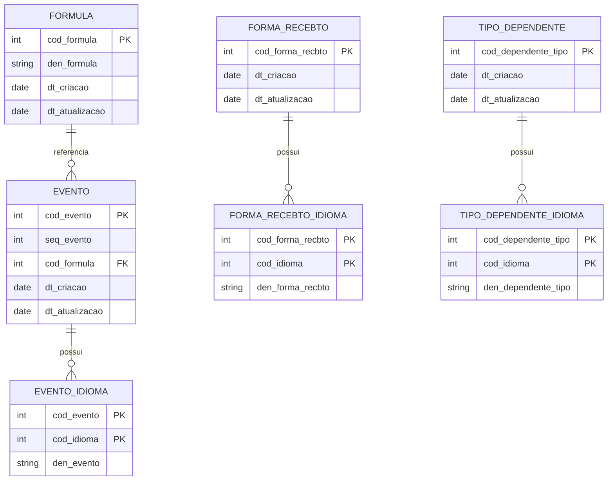

# README — msfolhapastores-dev

## Visão Geral

`msfolhapastores-dev` é uma aplicação **Java (JAX-RS/Jersey)** empacotada como **WAR** para cadastro e manutenção de entidades administrativas:

* **Eventos**
* **Formas de Recebimento**
* **Fórmulas**
* **Tipos de Dependente**

O projeto utiliza **JDBC** com **Apache Commons DBCP 1.4** para pool de conexões e **Oracle** como banco de dados. Não usa Spring.

> **Atenção:** O sistema está em **modo de manutenção corretiva** (sem novas funcionalidades). Os mapeamentos de alguns endpoints **PUT** estão incorretos no código (documentado abaixo) e devem ser mantidos **como estão** até decisão explícita de correção.

---

## Stack e Ferramentas

* **Java** 8 (JDK 1.8)
* **Jersey** 2.x (JAX-RS)
* **Maven** (empacotamento **WAR**)
* **Oracle JDBC** (ojdbc5)
* **Apache Commons DBCP** 1.4 (pool de conexões)
* **Log4j 2 (API/Core)** com **configuração antiga** (`log4j.properties` estilo 1.x)
* **Servlet Container**: Tomcat 8/9 (recomendado) ou compatível

Estrutura de pacotes (alto nível):

```
br/com/folhapastores/
 ├─ controller/    # Endpoints REST (JAX-RS)
 ├─ logica/        # Regras de negócio
 ├─ dao/           # Acesso a dados via JDBC
 ├─ modelo/        # Modelos/DTOs
 ├─ utils/         # Utilitários (permissão, parsing, etc.)
 └─ filter/        # Filtros (API Key, Token, Permissões)
```

---

## Diagrama de Entidades Relacionais (conceitual)

> O esquema abaixo representa o **modelo lógico** deduzido do código (DAOs e lógicas). Nomes de colunas podem variar conforme o ambiente; ajuste ao seu **DDL** real.



**Observações funcionais importantes**

* **Multilíngue**: `*_IDIOMA` guarda descrições por idioma (ex.: `cod_idioma` e `den_*`).
* **Integridade/Unicidade**: recomenda-se **constraint única** por (chave, `cod_idioma`) para evitar duplicidades.
* **Relação opcional** entre `EVENTO` e `FORMULA` (campo `cod_formula` pode ser nulo).

---

## Endpoints (como estão no código)

> **Respeitar exatamente o mapeamento atual** (mesmo quando semanticamente inadequado).

### Eventos

* **POST** `/eventos/inserir` → Inserir eventos (multilíngue)
* **PUT** `/eventos/inserir` → **Alterar** eventos *(mapeado como “/inserir” no código)*

### Formas de Recebimento

* **POST** `/formaRecebto/inserir` → Inserir formas (multilíngue)
* **PUT** `/formaRecebto/inserir` → **Alterar** formas *(mapeado como “/inserir” no código)*

### Fórmulas

* **POST** `/formulas/inserir` → Inserir fórmulas (validação de expressão)
* **PUT** `/formulas/alterar` → Alterar fórmulas (validação de expressão)

### Tipos de Dependente

* **POST** `/tipoDependente/inserir` → Inserir tipos (multilíngue)
* **PUT** `/tipoDependente/inserir` → **Alterar** tipos *(mapeado como “/inserir” no código)*

**Autorização/Permissão**
Requer cabeçalhos e/ou tokens validados pelos filtros (`filter/`), além de checagens na camada `utils/Simplifying` (ex.: `"inserir"`, `"editar"` por módulo).

---

## Regras de Negócio (resumo)

* **Permissão**: toda operação passa por `validaPermissao(módulo, ação)`.
* **Multilíngue**: inserção/alteração iterando as chaves de idioma do JSON enviado (`den_evento`, `den_forma_recbto`, `den_dependente_tipo`).
* **Checagem de existência**: `DAO.isEntidadeExiste(obj, flagAlteracao)` antes de `INSERT/UPDATE`.
* **Geração de IDs**: em **Eventos**, pode haver geração automática de `cod_evento`/`seq_evento` (dependendo da presença de `cod_formula` ou do fluxo).
* **Fórmulas (crítico)**: validação textual da expressão **por blacklist** (ex.: DROP/DELETE/INSERT/GRANT/…); **não** há parser/whitelist.

> **Limitação técnica**: as operações multilíngues **não são transacionais** por lote → risco de “meio commit” se falhar no meio.

---

## Pré-requisitos

* **JDK 8** instalado (`java -version`)
* **Maven 3.6+** (`mvn -version`)
* **Oracle** acessível (hostname, porta, SID/ServiceName)
* **ojdbc5.jar** disponível no repositório Maven corporativo ou configurado como dependência
* **Tomcat 8/9** (ou outro contêiner compatível)

---

## Configuração de Banco e Pool

As propriedades costumam ser carregadas por utilitários internos (ex.: `ConnectionFactory`, utils próprios). Adapte conforme seu ambiente:

**Exemplo de propriedades (Maven profile, `env` ou arquivo `.properties` da sua infra):**

```
db.driver=oracle.jdbc.OracleDriver
db.url=jdbc:oracle:thin:@//<HOST>:<PORT>/<SERVICE>
db.username=<USUARIO>
db.password=<SENHA>

# Pool (DBCP 1.4)
db.pool.maxActive=20
db.pool.maxIdle=10
db.pool.minIdle=2
db.pool.maxWait=30000
```

> **Dica:** se o datasource for configurado no **Tomcat**, use um `JNDI` e ajuste a `ConnectionFactory` para buscar do contexto.

---

## Build

Gerar o **WAR**:

```bash
mvn clean package -DskipTests
```

Artefato esperado:

```
target/msfolhapastores-dev.war
```

---

## Deploy (Tomcat)

1. Copie `target/msfolhapastores-dev.war` para `<TOMCAT_HOME>/webapps/`.
2. Inicie o Tomcat:

   ```bash
   <TOMCAT_HOME>/bin/startup.sh
   ```
3. Verifique logs:

   ```
   <TOMCAT_HOME>/logs/catalina.out
   ```

---

## Teste Rápido (cURL)

> Ajuste **host/porta/context** conforme seu Tomcat (ex.: `http://localhost:8080/msfolhapastores-dev`).

### Inserir Evento (multilíngue)

```bash
curl -X POST "http://localhost:8080/msfolhapastores-dev/eventos/inserir" \
  -H "Content-Type: application/json" \
  -H "Authorization: Bearer <TOKEN>" \
  -d '{
        "cod_evento": 0,
        "cod_formula": null,
        "den_evento": {"pt-br": "Evento A", "en-us": "Event A"},
        "permissao": {"acao": "inserir", "modulo": "evento"}
      }'
```

### Alterar Evento (**mapeado como /inserir no PUT**)

```bash
curl -X PUT "http://localhost:8080/msfolhapastores-dev/eventos/inserir" \
  -H "Content-Type: application/json" \
  -H "Authorization: Bearer <TOKEN>" \
  -d '{
        "cod_evento": 123,
        "den_evento": {"pt-br": "Evento A (novo)"},
        "permissao": {"acao": "editar", "modulo": "evento"}
      }'
```

### Inserir Fórmula

```bash
curl -X POST "http://localhost:8080/msfolhapastores-dev/formulas/inserir" \
  -H "Content-Type: application/json" \
  -H "Authorization: Bearer <TOKEN>" \
  -d '{
        "cod_formula": 0,
        "den_formula": "A + B * C",
        "permissao": {"acao": "inserir", "modulo": "formula"}
      }'
```

> **Erros comuns**: 403 (sem permissão), 409 (duplicidade), 400 (expressão inválida), 500 (erro interno/SQL).

---

## Logs e Observabilidade

* Dependências de **Log4j 2** com **arquivo de configuração legado** (`log4j.properties` 1.x).
* Recomenda-se ajustar o `classpath` para garantir que a configuração ativa seja consistente; nivele `INFO` por padrão.

**Boas práticas durante manutenção corretiva**:

* Não logar PII/token em claro.
* Adotar **correlação de requisições** (traceId simples em MDC, se possível).
* Padronizar mensagens de erro ao cliente.

---

## Operação e Manutenção (o que é necessário)

* **Time**: 4 devs (2 sêniores + 2 plenos) dedicados a correções e pequenos ajustes.
* **Procedimento**:

  1. Criar **branch** para a correção.
  2. Alterar **DAO/Logica** com **o mínimo necessário**.
  3. Realizar **testes manuais** em base de homologação espelhada (foco em multilíngue).
  4. Atualizar **changelog** e evidências (payloads de teste e respostas).
  5. Gerar **WAR** e publicar em janela de manutenção.
* **Riscos**:

  * Duplicidade de registros por **race condition** (checa/existe → insere).
  * **Meio commit** em operações multilíngues (sem transação por lote).
  * Validação frágil de fórmulas (blacklist).

> **Recomendação** (sem refatoração estrutural): quando possível, aplicar **constraint de unicidade** no banco e tratar **violação como 409**; e validar payloads no **controller** antes de acionar DAO.

---

## Estrutura de Pastas (essencial)

```
msfolhapastores-dev/
 ├─ pom.xml
 ├─ src/
 │   ├─ br/com/folhapastores/controller/
 │   ├─ br/com/folhapastores/logica/
 │   ├─ br/com/folhapastores/dao/
 │   ├─ br/com/folhapastores/modelo/
 │   ├─ br/com/folhapastores/utils/
 │   └─ br/com/folhapastores/filter/
 └─ WebContent/
     └─ WEB-INF/web.xml
```

---

## Notas Importantes

* **Não alterar** mapeamentos de endpoints **neste momento** (ex.: `PUT /eventos/inserir` etc.).
* Evitar **atualização de bibliotecas** (DBCP, ojdbc, Jersey) enquanto o sistema estiver em produção e sem suíte de testes.
* Cada entrega deve incluir **evidências manuais** (requisições e respostas) e validação de **todas** as variantes de idioma afetadas.

---

## Licença / Compliance

Este repositório é **interno**. Avalie políticas corporativas para redistribuição, dados sensíveis e logs antes de publicar artefatos.
