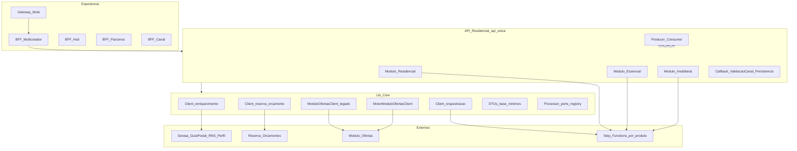
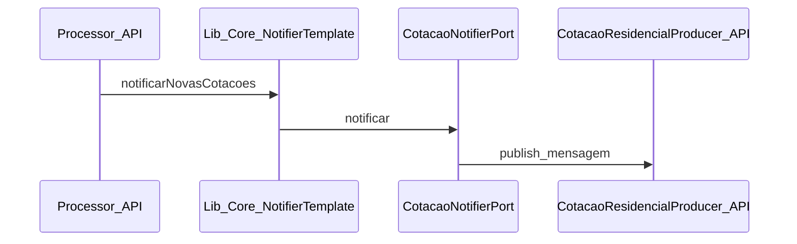
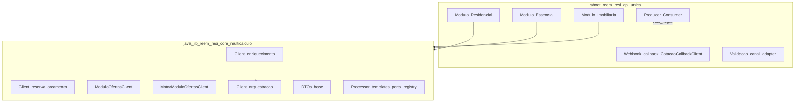
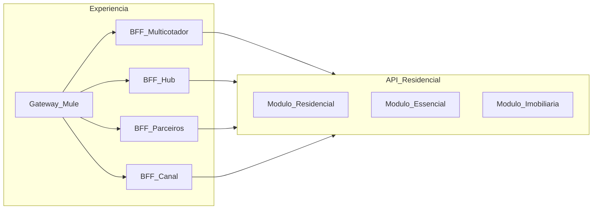
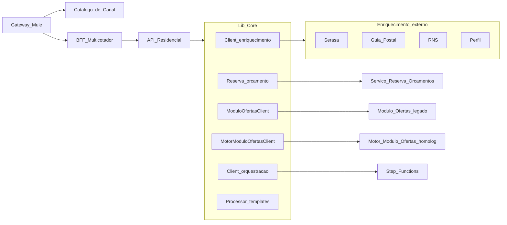
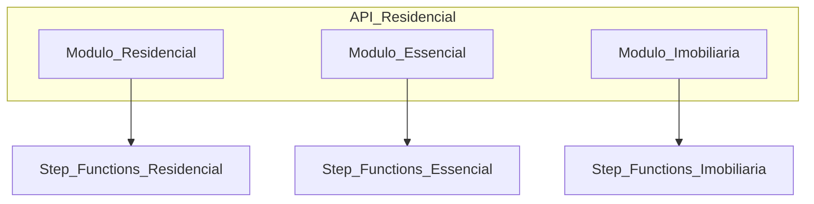
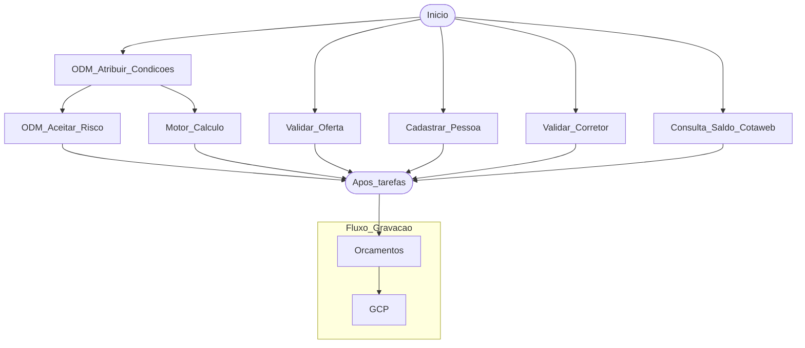

# DEVPLAN — Lib-Core de Multicalculo RESI (`java-lib-reem-resi-core-multicalculo`)

**Documento único e autoritativo** para extração do núcleo de multicalculo/orçamento da API única, alinhado à reunião com TL (Simon Bolívar) e aos diagramas de arquitetura do squad RESI.

| Metadado | Valor |
|----------|--------|
| **Participantes (reunião TL)** | Edmilson Guimarães, Simon Bolívar |
| **Responsável execução Fase B** | Edmilson Guimarães |
| **Atualização diagramas** | Simon / arquitetura (agenda do squad) |
| **Host principal** | `sboot-reem-resi-api-unica` |
| **Artefato alvo** | `java-lib-reem-resi-core-multicalculo` |

---

## Sumário

1. [Contexto e objetivo](#1-contexto-e-objetivo)
2. [Decisões da reunião com TL](#2-decisões-da-reunião-com-tl)
3. [Composição da Lib-Core](#3-composição-da-lib-core)
4. [Fronteira lib-core × api-unica](#4-fronteira-lib-core--api-unica)
5. [Arquitetura de referência (diagramas)](#5-arquitetura-de-referência-diagramas)
6. [Desacoplamento do commons-dto](#6-desacoplamento-do-commons-dto)
7. [Estado atual do workspace](#7-estado-atual-do-workspace)
8. [Roadmap por fases](#8-roadmap-por-fases)
9. [Critérios de conclusão, riscos e governança](#9-critérios-de-conclusão-riscos-e-governança)
10. [Próximos passos](#10-próximos-passos)

---

## 1. Contexto e objetivo

### 1.1 Problema

A `sboot-reem-resi-api-unica` concentra hoje lógica **genérica** de multicalculo (enriquecimento, reserva de orçamento, módulo de ofertas, templates de processor, delegate de serviço) misturada com lógica **por produto** (Residencial, Essencial, Imobiliária) e com **infraestrutura de mensageria** (producer/consumer). Isso dificulta:

- Reuso entre produtos RESI e futuros serviços “do zero”.
- Evolução independente da lib-core vs contratos HTTP (`commons-dto`).
- Alinhamento com o padrão de squad já usado em Celular (API central + módulos + Step Functions por produto).

### 1.2 Objetivo

Extrair para **`java-lib-reem-resi-core-multicalculo`** o núcleo reutilizável descrito no diagrama **Lib-Core: Clients + DTOs-base + Processor**, mantendo na API única apenas:

- Módulos de produto e disparo das Step Functions específicas.
- Producer/consumer de mensageria.
- Adapters de persistência, callback webhook e validação de canal.

### 1.3 Visão alvo (fluxo orçamento)

```text
Experience (Gateway Mule → BFFs)
    → API-Residencial (módulos Residencial / Essencial / Imobiliária)
        → Lib-Core (clients genéricos + DTOs-base + processor)
            → Serviços externos (enriquecimento, reserva, ofertas)
            → Step Functions (orquestração por produto)
        → Retorno SF / Webhook → BFF
    → Fluxo gravação (Orçamentos, GCP)
```

### 1.4 Padrão de referência (squad)

| Squad | API central | Módulos | Orquestração |
|-------|-------------|---------|--------------|
| **RESI** | API-Residencial (`sboot-reem-resi-api-unica`) | Residencial, Essencial, Imobiliária | Step Functions por produto |
| **Celular** (analogia) | API-Valor-Mercado | Celular, Portáteis, Bike | Step Functions por produto |

Objetivo de longo prazo: um **novo serviço Spring Boot** importa só a lib-core, define seus DTOs, implementa ports/interfaces e obtém fluxo de cálculo **sem** acoplamento a produto RESI específico.

---

## 2. Decisões da reunião com TL

**Fonte:** transcrição Edmilson / Simon (conteúdo não relacionado ao projeto — shows, viagens, etc. — **ignorado**).

**Referência visual:** diagramas de afinidade RESI/Celular e fluxo orçamento (Gateway → BFFs → API → Lib-Core → externos/SF). O TL pode acrescentar/atualizar diagramas na agenda do squad.

### 2.1 Tabela decisão (transcrição → engenharia)

| Tema (Simon) | Decisão | Onde fica | Observação |
|--------------|---------|-----------|------------|
| *“Client enriquecimento estaria dentro da lib-core junto com os DTO”* | Migrar client + config + service + mapper de enriquecimento | Lib: `core.multicalculo.client.enriquecimento` | Integrações: Serasa, Guia Postal, RNS, Perfil (diagrama fluxo orçamento) |
| *“Reserva de orçamento é genérica… mesma reserva para todos os produtos… também na lib junto com o DTO”* | Migrar `OrcamentoClient` + DTOs de reserva | Lib: `core.multicalculo.client.orcamento` | Validado: `AbstractCotacaoProdutoProcessor` usa o mesmo fluxo para qualquer produto |
| *“Dois módulos de oferta dentro da API única”* | Migrar **ambos** agora; remover legado depois | Lib: `...client.oferta` + `...client.oferta.motor` | Ver **§2.2** |
| *“Não são dois orquestradores”* (correção Edmilson na call) | Os dois clients são de **oferta**, não de Step Functions | — | Não confundir com client de orquestração |
| *“Dá para incluir os dois por enquanto; depois a gente apaga um”* | Fase transitória; critério de corte quando motor estável em produção | Feature flag no host: `resi.oferta.client=motor\|legado` | Fase **B.7** |
| *“Producer/consumer… melhor deixar fora da lib-core… na aplicação mesmo”* | **Não** mover mensageria para o jar | API: `messaging/producer/*`, `messaging/consumer/CotacaoConsumer` | Decisão **não negociável** |
| Motivo producer/consumer: *“classe com duas linhas… difícil injeção no módulo core… pulling”* | Lib expõe **port** de notificação; API implementa com producer local | `CotacaoNotifierPort` na lib; `AbstractCotacaoNotifier` na API | Ver **§4.3** |
| *“Client de orquestração”* | Client Step Functions na lib-core | Lib: `core.multicalculo.client.orquestracao` | **Ainda não identificado no workspace** — Fase **B.0** bloqueante para B.5 |

### 2.2 Dois clients de oferta (não são orquestradores)

Na call houve confusão momentânea entre “dois orquestradores” e “dois módulos de oferta”. **Decisão explícita do TL:**

| Client na API única | Papel | Estado |
|---------------------|-------|--------|
| **`ModuloOfertasClient`** | Integração legada / mockada | Em uso |
| **`MotorModuloOfertasClient`** | Integração em homologação; substituição futura do legado | Plugável no futuro |

**Orquestração** = integração com **AWS Step Functions** (`Client de orquestração`), **separado** dos dois clients de oferta.

**Política transitória:** incluir os dois na lib-core nesta fase; após homologação/produção estável do motor, **apagar o legado** (Fase B.7) e documentar versão mínima da lib.

### 2.3 O que **não** foi decidido mover para a lib

- Producers e consumer SQS/SNS (simplicidade + injeção Spring + pull na aplicação host).
- Módulos de produto (processors/services Residencial, Essencial, Imobiliária).
- Callback webhook, validação de canal, repositórios DynamoDB (adapters na API; **ports** na lib).
- DTOs específicos por produto (ex.: `ListaInteligenciaOfertaResidencialResponseImpl`).

### 2.4 Alinhamento prévio (desacoplamento DTO)

Conversa anterior com liderança (consolidada neste DEVPLAN — **§6**): a core **não deve depender** de `java-lib-reem-resi-commons-dto` em compilação; tipos mínimos na lib + mapeamento na borda da API. TL aprovou: *“Sim, pode seguir nessa linha.”*

---

## 3. Composição da Lib-Core

Alinhado ao bloco **Lib-Core** do diagrama de fluxo orçamento:

| Pilar | Conteúdo | Responsabilidade |
|-------|----------|------------------|
| **Clients** | Enriquecimento, reserva orçamento, oferta (legado + motor), orquestração | Chamadas HTTP/Feign a serviços externos genéricos |
| **DTOs-base** | Tipos mínimos de multicalculo (`CotacaoOperacaoContext`, callback de gravação, DTOs de integração dos clients) | Sem contrato REST público; sem Bean Validation do commons |
| **Processor** | Ports, delegate, registry, templates, correlation id, reserva em batch, telemetry SPI | Orquestração **in-process** do fluxo de cotação |

### 3.1 Dependências Maven da lib

| Dependência | Curto prazo | Médio prazo (meta) |
|-------------|-------------|-------------------|
| `java-lib-reem-resi-commons-dto` | Presente no `pom.xml` atual | **Remover** após Fase D / §6 |
| `slf4j-api` | Manter | Manter |
| `spring-boot-starter-test` | Test scope | Manter |
| Spring Web / Feign (clients) | Via config opcional no host | Factories `@Configuration` opcionais na lib; beans ativados pelo host |

**Nunca no jar da lib:** producer/consumer, credenciais de fila, implementação de repositório, controllers REST.

### 3.2 Diagrama — Lib-Core no ecossistema


```mermaid
flowchart TB
  subgraph exp [Experiencia]
    GW[Gateway_Mule]
    BFF_MC[BFF_Multicotador]
    BFF_Hub[BFF_Hub]
    BFF_Par[BFF_Parceiros]
    BFF_Canal[BFF_Canal]
  end

  subgraph api [API_Residencial_api_unica]
    ModResi[Modulo_Residencial]
    ModEss[Modulo_Essencial]
    ModImo[Modulo_Imobiliaria]
    Msg[Producer_Consumer]
    Adapters[Callback_ValidacaoCanal_Persistencia]
  end

  subgraph libCore [Lib_Core]
    CliEnr[Client_enriquecimento]
    CliRes[Client_reserva_orcamento]
    CliMOF[ModuloOfertasClient_legado]
    CliMotor[MotorModuloOfertasClient]
    CliOrq[Client_orquestracao]
    DTOs[DTOs_base_minimos]
    Proc[Processor_ports_registry]
  end

  subgraph ext [Externos]
    EnrExt[Serasa_GuiaPostal_RNS_Perfil]
    ResExt[Reserva_Orcamentos]
    OfExt[Modulo_Ofertas]
    SF[Step_Functions_por_produto]
  end

  GW --> BFF_MC
  BFF_MC --> api
  api --> libCore
  CliEnr --> EnrExt
  CliRes --> ResExt
  CliMOF --> OfExt
  CliMotor --> OfExt
  CliOrq --> SF
  ModResi --> SF
  ModEss --> SF
  ModImo --> SF
  Msg -.->|"fora_da_lib"| api
```

---

## 4. Fronteira lib-core × api-unica

### 4.1 Dentro da lib-core (migrar da API)

| Componente | Paths atuais (`sboot-reem-resi-api-unica`) | Pacote alvo na lib |
|------------|---------------------------------------------|-------------------|
| **Enriquecimento** | `client/EnriquecimentoClient.java` | `core.multicalculo.client.enriquecimento` |
| | `client/config/EnriquecimentoClientConfig.java` | |
| | `service/impl/EnriquecimentoClientService.java` (se existir) | |
| | `mapper/EnriquecimentoRequestMapper.java` (se existir) | |
| **Reserva orçamento** | `client/OrcamentoClient.java` | `core.multicalculo.client.orcamento` |
| | `client/config/OrcamentoClientConfig.java` | |
| | `domain/dto/client/request/orcamento/ReservaNumeroOrcamentoRequest.java` | |
| | `domain/dto/client/response/orcamento/ReservaNumeroOrcamentoResponse.java` | |
| **Oferta legado** | `client/ModuloOfertasClient.java` | `core.multicalculo.client.oferta` |
| | `client/config/ModuloOfertasClientConfig.java` | |
| | `service/impl/ModuloOfertasClientService.java` (se existir) | |
| | `mapper/EnquadrarOfertaRequestMapper.java`, `EnquadrarOfertaResponseMapper.java` (se existirem) | |
| **Oferta motor** | `client/MotorModuloOfertasClient.java` | `core.multicalculo.client.oferta.motor` |
| | `client/config/MotorModuloOfertasClientConfig.java` | |
| **Orquestração** | **A identificar** (Fase B.0) | `core.multicalculo.client.orquestracao` |

**Nota:** `CotacaoCallbackClient` é adapter de **webhook para o BFF** — permanece na API (não é client de orquestração SF).

### 4.2 Fora da lib-core (permanece na API)

| Componente | Paths | Motivo |
|------------|-------|--------|
| **Producers** | `messaging/producer/CotacaoResidencialProducer.java` | Decisão TL: simplicidade + injeção |
| | `messaging/producer/CotacaoEssencialProducer.java` | |
| | `messaging/producer/RemoverOrcamentoResidencialProducer.java` | |
| | `messaging/producer/impl/*` | |
| **Consumer** | `messaging/consumer/CotacaoConsumer.java` | Pull / infraestrutura na aplicação |
| **Módulos produto** | Processors/services Residencial, Essencial, Imobiliária | Regras por produto + SF específica |
| **Adapters** | `CotacaoCallbackServiceImpl`, `ValidacaoCanalServiceImpl` | Ports na lib; HTTP/persistência no host |
| | Repositórios (`CotacaoCallbackRepository`, `ValidacaoRepository`, etc.) | |
| **DTOs por produto** | ex. `ListaInteligenciaOfertaResidencialResponseImpl` | Contrato BFF / inteligência por produto |
| **Callback BFF** | `client/CotacaoCallbackClient.java` | Webhook de retorno ao multicotador |

### 4.3 Padrão producer/consumer

A lib define **`CotacaoNotifierPort`** e **`AbstractCotacaoNotifierTemplate`**. A API implementa o port delegando ao producer local.


```mermaid
sequenceDiagram
  participant Proc as Processor_API
  participant Lib as Lib_Core_NotifierTemplate
  participant Port as CotacaoNotifierPort
  participant Prod as CotacaoResidencialProducer_API

  Proc->>Lib: notificarNovasCotacoes
  Lib->>Port: notificar
  Port->>Prod: publish_mensagem
```

**Citação TL:** *“O producer é muito simples… classe com duas linhas… vai ficar difícil se você coloca no módulo core a injeção… ele faz um pulling… melhor deixar na aplicação mesmo.”*

### 4.4 Resumo visual da fronteira


```mermaid
flowchart TB
  subgraph apiHost [sboot_reem_resi_api_unica]
    BFF_hook[Webhook_callback_CotacaoCallbackClient]
    ValCanal[Validacao_canal_adapter]
    ProdResi[Modulo_Residencial]
    ProdEss[Modulo_Essencial]
    ProdImo[Modulo_Imobiliaria]
    ProdCons[Producer_Consumer]
  end

  subgraph coreJar [java_lib_reem_resi_core_multicalculo]
    CliEnr[Client_enriquecimento]
    CliRes[Client_reserva_orcamento]
    CliOf1[ModuloOfertasClient]
    CliOf2[MotorModuloOfertasClient]
    CliOrq[Client_orquestracao]
    DTOs[DTOs_base]
    Proc[Processor_templates_ports_registry]
  end

  ProdResi --> coreJar
  ProdEss --> coreJar
  ProdImo --> coreJar
  ProdCons -.->|nao_migra| apiHost
  coreJar --> CliOrq
```

---

## 5. Arquitetura de referência (diagramas)

### 5.1 Afinidade de produtos RESI (BFF → API)


```mermaid
flowchart LR
  subgraph exp [Experiencia]
    GW[Gateway_Mule]
    BFF_MC[BFF_Multicotador]
    BFF_Hub[BFF_Hub]
    BFF_Par[BFF_Parceiros]
    BFF_Canal[BFF_Canal]
  end

  GW --> BFF_MC
  GW --> BFF_Hub
  GW --> BFF_Par
  GW --> BFF_Canal

  subgraph APIRes [API_Residencial]
    ModResi[Modulo_Residencial]
    ModEss[Modulo_Essencial]
    ModImo[Modulo_Imobiliaria]
  end

  BFF_MC --> APIRes
  BFF_Hub --> APIRes
  BFF_Par --> APIRes
  BFF_Canal --> APIRes
```

### 5.2 Fluxo orçamento — entrada até externos


```mermaid
flowchart LR
  GW[Gateway_Mule]
  Cat[Catalogo_de_Canal]
  BFF[BFF_Multicotador]
  API[API_Residencial]

  subgraph libCore [Lib_Core]
    CliEnr[Client_enriquecimento]
    CliRes[Reserva_orcamento]
    CliMOF[ModuloOfertasClient]
    CliMotor[MotorModuloOfertasClient]
    CliOrq[Client_orquestracao]
    Proc[Processor_templates]
  end

  subgraph enr [Enriquecimento_externo]
    Ser[Serasa]
    GP[Guia_Postal]
    RNS[RNS]
    Per[Perfil]
  end

  GW --> Cat
  GW --> BFF
  BFF --> API
  API --> libCore
  CliEnr --> enr
  CliRes --> ResExt[Servico_Reserva_Orcamentos]
  CliMOF --> MOFExt[Modulo_Ofertas_legado]
  CliMotor --> MotorExt[Motor_Modulo_Ofertas_homolog]
  CliOrq --> SF[Step_Functions]
```

Retornos típicos: **Retorno SF** (orquestração → API) e **Webhook** (API → BFF via `CotacaoCallbackClient`).

### 5.3 Step Functions por produto


```mermaid
flowchart TB
  subgraph APIRes [API_Residencial]
    MR[Modulo_Residencial]
    ME[Modulo_Essencial]
    MI[Modulo_Imobiliaria]
  end

  MR --> SFR[Step_Functions_Residencial]
  ME --> SFE[Step_Functions_Essencial]
  MI --> SFI[Step_Functions_Imobiliaria]
```

### 5.4 Orquestração interna da SF e gravação


```mermaid
flowchart TB
  Ini([Inicio])

  Ini --> ODM_AC[ODM_Atribuir_Condicoes]
  ODM_AC --> ODM_AR[ODM_Aceitar_Risco]
  ODM_AC --> MOTOR[Motor_Calculo]

  Ini --> VAL_O[Validar_Oferta]
  Ini --> CAD_P[Cadastrar_Pessoa]
  Ini --> VAL_C[Validar_Corretor]
  Ini --> SALDO[Consulta_Saldo_Cotaweb]

  ODM_AR --> Junta([Apos_tarefas])
  MOTOR --> Junta
  VAL_O --> Junta
  CAD_P --> Junta
  VAL_C --> Junta
  SALDO --> Junta

  Junta --> ORC[Orcamentos]

  subgraph gravacao [Fluxo_Gravacao]
    ORC
    GCP[GCP]
    ORC --> GCP
  end
```

**Papel da lib:** orquestrar **chamadas** via clients configuráveis; SF, ODM, GCP e integrações externas permanecem fora do jar.

---

## 6. Desacoplamento do `commons-dto`

### 6.1 Decisão consolidada

1. **Remover** dependência Maven de `java-lib-reem-resi-commons-dto` da core-multicalculo.
2. A core expõe **tipos mínimos próprios** (sem anotações Jackson/OpenAPI/validações do commons no jar da core).
3. A **api-unica** mantém contrato HTTP/JSON (`commons-dto` na borda) e aplica **mapeamento explícito** para tipos da core.
4. DTOs **por produto** permanecem na api-unica.
5. Serviço “do zero” importa só core + seus DTOs + implementações de ports.

**Leitura aprovada:** tipos da core são **domínio do multicalculo**, não substituem o DTO REST público sem mapper na API.

### 6.2 Objetivos mensuráveis

| ID | Objetivo | Critério de aceite |
|----|-----------|-------------------|
| O1 | Core sem `commons-dto` | `mvn dependency:tree` na core não lista `commons-dto` |
| O2 | Core sem `commons` (validações) | Nenhum tipo da core referencia validações do commons |
| O3 | Templates compilam com tipos core + SLF4J | `mvn -q test` na core verde |
| O4 | Api-unica mantém contratos atuais na borda | Mappers + testes de regressão |
| O5 | Serviço “do zero” documentado | README ou §6.7 com pacotes mínimos |

### 6.3 Tipos alvo na lib

Pacote sugerido: `com.porto.resi.core.multicalculo.model`

| Tipo | Substitui | Campos mínimos (auditar Fase D.0) |
|------|-----------|-----------------------------------|
| `CotacaoOperacaoContext` | `BaseCotacaoRequest` na core | `codigoCanal`, `numeroOrcamentoExterno`, demais usados por reserva/delegate |
| `CotacaoCallbackGravacaoInput` | `BaseCotacaoCallbackRequest` no port | `verbo`, `statusCode`, `secret`, `url` |

Genéricos: `<T extends BaseCotacaoRequest>` → `<C extends CotacaoOperacaoContext>` (ou interface equivalente).

### 6.4 Uso atual do commons-dto na core (baseline)

| Artefacto | Tipos |
|-----------|-------|
| `CotacaoProcessor`, `CotacaoProcessorForUpdate` | `BaseCotacaoRequest` |
| `CotacaoProdutoServiceDelegate` | `BaseCotacaoRequest`, `BaseCotacaoCallbackRequest` |
| `CallbackGravacaoPort` | `BaseCotacaoCallbackRequest` |
| `CotacaoNotifierPort`, templates | `BaseCotacaoRequest` |
| `CotacaoProdutoProcessorSupport`, factories | `BaseCotacaoRequest` |

**Relação com migração de clients (Fase B):** ao mover clients, não puxar DTOs pesados do `commons-dto` para dentro da lib sem mapeamento; preferir DTOs de integração na lib ou mappers na borda.

### 6.5 Borda na api-unica

| Componente | Ação |
|------------|------|
| Controllers / DTOs REST | Podem manter `BaseCotacaoRequest` do `commons-dto` até migração HTTP |
| `CotacaoCoreMapper` (exemplo) | `BaseCotacaoRequest` → `CotacaoOperacaoContext`; callback → `CotacaoCallbackGravacaoInput` |
| `AbstractCotacaoProdutoService` | Chama delegate com tipos core após mapeamento |
| `CotacaoCallbackService.gravar` | Mapper na primeira linha se assinatura pública permanecer em commons-dto |

### 6.6 Fases de desacoplamento (Fase D)

| Fase | Entregável |
|------|------------|
| **D.0** | Matriz campo-a-campo commons-dto → tipos core (grep em core + API) |
| **D.1** | Criar records/interfaces em `...model` |
| **D.2** | Refatorar ports, delegate, processor support, notifier template; remover `commons-dto` do `pom.xml` da core |
| **D.3** | Mappers e ajustes na api-unica (`MulticalculoCoreConfiguration`, `Identified*`) |
| **D.4** | Regressão, versionamento semver (ex. **2.0.0** se breaking), release notes |
| **D.5** (opcional) | Épico corporativo sobre futuro do artefato `commons-dto` |

### 6.7 Serviço “do zero” (checklist mínimo)

1. Dependência Maven: `java-lib-reem-resi-core-multicalculo` (sem `commons-dto` na core após Fase D).
2. Implementar: `CotacaoProcessor`, `CotacaoProcessorForUpdate`, `CotacaoNotifierPort`, `CallbackGravacaoPort`, `ValidacaoCanalPort` (se necessário), `OfertaPort`.
3. Registrar produtos em `ProductRegistry` / `ProductRegistries`.
4. Configurar beans Feign dos clients migrados (URLs no `application.yml` do host).
5. Definir DTOs REST próprios + mappers → `CotacaoOperacaoContext`.
6. Producer/consumer **no host** se houver mensageria.

### 6.8 Riscos específicos do desacoplamento

| Risco | Mitigação |
|-------|-----------|
| Campo usado só em runtime na reserva | Matriz D.0 + teste integração com payload real |
| Divergência JSON público vs modelo core | Uma camada de mapper; fixtures JSON nos testes |
| Breaking change consumidores da core 1.x | Major version + release notes |

---

## 7. Estado atual do workspace

### 7.1 Lib-core (`java-lib-reem-resi-core-multicalculo`)

| Item | Situação |
|------|----------|
| Classes Java | ~23 — delegate, ports, registry, processor support, telemetry SPI |
| Clients de integração | **Ausentes** na lib (ainda na API) |
| Dependência `commons-dto` | Presente no `pom.xml` |
| `ProductRegistry` | Implementado; beans na API ainda vazios / stub |

**Núcleo já na lib:**

- **Ports:** `CallbackGravacaoPort`, `ValidacaoCanalPort`, `CotacaoNotifierPort`, `OfertaPort`; `CotacaoProcessor` / `CotacaoProcessorForUpdate`.
- **Serviço:** `CotacaoProdutoServiceDelegate`, `CotacaoRecebidaResult`.
- **Processor:** `CotacaoProdutoProcessorSupport`, `CotacaoNotificacaoSupport`, `AbstractCotacaoNotifierTemplate`, fábricas de reserva/batch, `CorrelationIdStrategies`.
- **Registro:** `ProductRegistry`, `ProductRegistries`, `IdentifiedCotacaoProcessor*`, `MulticalculoProducts`.
- **Telemetry:** `TelemetryBridge`, `NoOpTelemetryBridge`.

### 7.2 API única (`sboot-reem-resi-api-unica`)

| Item | Situação |
|------|----------|
| Clients em `com.porto.resi.client` | `EnriquecimentoClient`, `OrcamentoClient`, `ModuloOfertasClient`, `MotorModuloOfertasClient`, `CotacaoCallbackClient` + configs Feign |
| Orquestração SF | **Sem classe dedicada** no repo — Fase **B.0** |
| Messaging | Producers + `CotacaoConsumer` na API (correto per TL) |
| Services transcritos | `CotacaoCallbackServiceImpl`, `ValidacaoCanalServiceImpl` (adapters) |

---

## 8. Roadmap por fases

### Fase A — Núcleo processor (em andamento)

| # | Tarefa | Critério de aceite | Responsável |
|---|--------|-------------------|-------------|
| A.1 | `mvn clean install` lib + API | Build verde | Edmilson |
| A.2 | Preencher `ProductRegistry` | Residencial / Essencial / Imobiliária sem `@Qualifier` | Edmilson |
| A.3 | Correlation id alinhado à reserva | Mesma estratégia em processor API e lib | Edmilson |
| A.4 | `TelemetryBridge` real no host | Métricas sem dep obrigatória na lib | Edmilson |

### Fase B — Clients genéricos (decisão reunião TL)

**Ordem recomendada** (menor acoplamento primeiro):

| # | Tarefa | Entregável | Notas |
|---|--------|------------|-------|
| **B.0** | Inventário **client orquestração** | ADR: classe existente **ou** nova `OrquestracaoClient` + contrato | Buscar outros branches, SDK AWS, código não commitado — **bloqueante para B.5** |
| **B.1** | Migrar **enriquecimento** | Jar lib: client + config + service + mapper | `EnriquecimentoClient*` |
| **B.2** | Migrar **reserva orçamento** | `OrcamentoClient` + `ReservaNumeroOrcamento*` | Validar nos 3 produtos |
| **B.3** | Migrar **ModuloOfertas** (legado) | Client + config + service + mappers | Mock/legado |
| **B.4** | Migrar **MotorModuloOfertas** | Client + config | `resi.oferta.client=motor\|legado` no host |
| **B.5** | Migrar **orquestração** | `...client.orquestracao` | **Somente após B.0** |
| **B.6** | Limpeza na API | Remover duplicatas em `com.porto.resi.client` | Imports → lib |
| **B.7** | Corte pós-homologação | Remover `ModuloOfertas*` legado | Motor estável em produção; release documentada |

**Configuração:** Feign/WebClient em `@Configuration` opcional na lib; URLs/credenciais no `application.yml` do host.

### Fase C — Explicitamente fora do escopo da lib

- Producers e consumer em `sboot-reem-resi-api-unica/.../messaging` — **§4.2**, **§4.3**.
- `AbstractCotacaoNotifier` na API estende `AbstractCotacaoNotifierTemplate` e delega ao producer local.
- Adapters: callback webhook, validação de canal, repositórios.

### Fase D — Desacoplamento DTO + publicação

Executar **§6.6** (fases D.0–D.4). Publicar lib no Nexus; travar versão na API. Comunicar breaking change se ports mudarem.

---

## 9. Critérios de conclusão, riscos e governança

### 9.1 Critérios de conclusão do épico

- [ ] Lib publicada com clients: enriquecimento, reserva, ofertas (motor + legado até B.7), orquestração.
- [ ] API sem duplicação em `com.porto.resi.client` para esses integradores (exceto `CotacaoCallbackClient`).
- [ ] Producer e consumer **somente** na API.
- [ ] Core **sem** dependência de compilação em `commons-dto` (Fase D).
- [ ] DEVPLAN único revisado pelo squad RESI.

### 9.2 Riscos e mitigações

| Risco | Mitigação |
|-------|-----------|
| Dois clients de oferta divergem em contrato | Testes de contrato; flag `resi.oferta.client` |
| Orquestração não localizada | **B.0 bloqueante** antes de B.5 |
| Migrar client e puxar `commons-dto` para a lib | §6: DTOs de integração na lib ou mappers na borda |
| Producer na lib quebra injeção/pull | Manter `CotacaoNotifierPort` + impl na API (TL) |
| Divergência JSON vs modelo core | Mapper único na API; fixtures nos testes |

### 9.3 Governança

| Ação | Responsável |
|------|-------------|
| Executar Fase B (extração clients genéricos) | Edmilson |
| Atualizar diagramas (afinidade RESI + fluxo orçamento) | Simon / arquitetura |
| Corte do client legado de oferta após homologação do motor | Time RESI |
| Revisar este DEVPLAN após B.0 e B.7 | Time RESI |

---

## 10. Próximos passos

1. **Edmilson:** executar **B.0** (inventário orquestração), depois **B.1 → B.6** na ordem da tabela.
2. **Time:** após homologação do **MotorModuloOfertas**, executar **B.7** e revisar versão da lib-core.
3. **Paralelo:** Fase A (registry, build) enquanto B.0 é investigado.
4. **Médio prazo:** Fase D (**§6**) para remover `commons-dto` do classpath da core.
5. **Simon:** acrescentar/atualizar diagramas na documentação/agenda do squad quando disponíveis.

---

*Última consolidação: reunião TL (client enriquecimento, reserva genérica, dois módulos de oferta, producer/consumer fora da lib, client de orquestração) + alinhamento desacoplamento commons-dto.*
